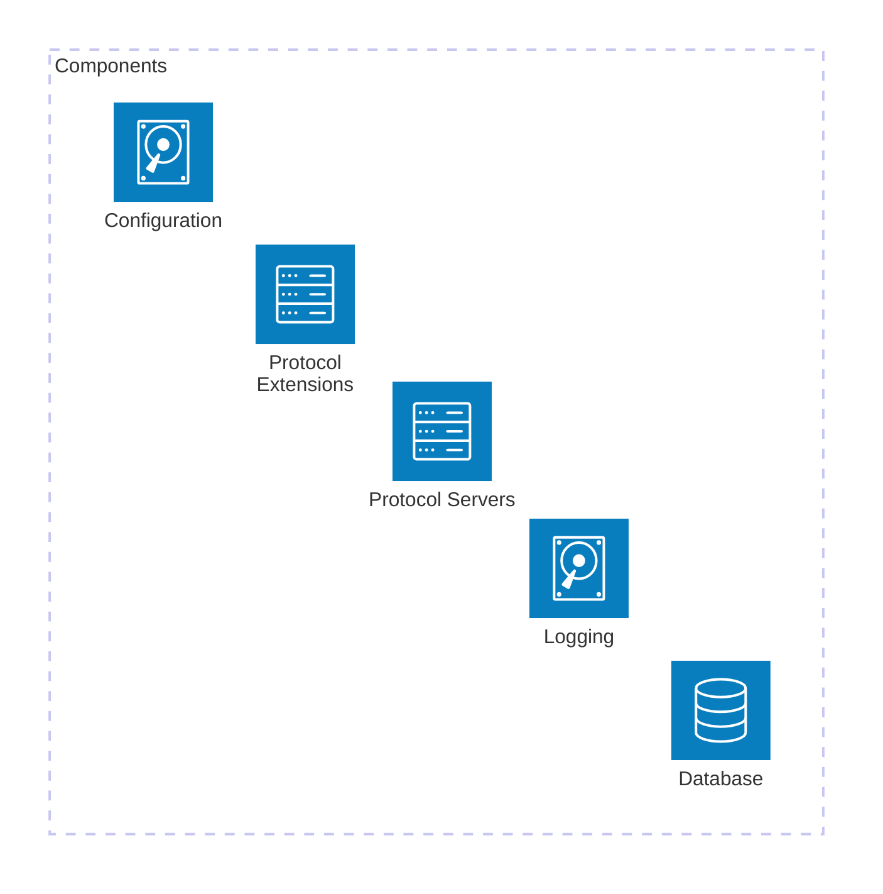

# **Dementor**{: .dm-title-gradient}'s Architecture
{: data-toc-skip='' }

In the previous post, I briefly discussed the motivation and general purpose behind *Dementor*.
In this article, I’ll go through the main components that make up its architecture.

Fair warning: there are still no test cases here (I know, I know, more text). But trust me,
understanding the architecture first will make everything else a lot easier to follow once we start using it.

## Core Components

The core architecture of Dementor is built on top of five primary components:

1. Database (`DementorDB`)
2. Logging System
3. Configuration
4. Protocol Servers
5. Protocol Extensions

Each of these components plays a distinct role in how *Dementor* operates.


Before diving into each component, it’s important to clarify a few core terms.
Every Dementor session relies on a global configuration and a workspace directory, which is where the database and log files are stored. Although specifying a workspace directory is optional, it is enabled by default. The default location is: `~/.dementor/`{: .file-path }.

### Database

The database (`DementorDB`) is responsible for storing all captured credentials, password hashes, and host-related information. The configuration allows you to define both the database engine (DBMS) and the storage location. By default, Dementor uses a local SQLite database named `Dementor.db`, located in the workspace directory.

At the time of writing, the database schema consists of three tables:

- `credentials` - Contains all captured credentials or hashes. Each entry also references the host that attempted authentication.
- `hosts` - Stores all identified hosts, including multicast and direct connections.
- `extras` - (Experimental) Stores additional metadata about hosts, such as user agents used when connecting to HTTP servers.

Dementor supports all databases compatible with [*SQLAlchemy*](https://docs.sqlalchemy.org/). While SQLite is the default, switching to another database is as simple as providing a SQLAlchemy connection URL in the configuration.
For example, to use MySQL, your configuration (`Dementor.toml`{: .file-path }) would look like this:

```toml
[DB]
# The Python package 'pymysql' must be installed before running Dementor
Url = "mysql+pymysql://<user>:<password>@<host>:3306/<database-name>"
```
{: file-path="Dementor.toml" }

Next time you launch *Dementor*, it’ll show a message confirming the new setup:

{: .w-90 .rounded-10 w='1212' h='668' .shadow .img-border }
*Custom database connection*

> The only drawback to this flexible model is that *Dementor* does not include third-party database drivers by default - you’ll need to install the appropriate Python package manually.
{: .prompt-info }

---

### Logging System

The logging system is one of Dementor’s most important features, providing both real-time and persistent insight into its activity. It consists of three main layers:


- Traditional file-based log
    When enabled via the `Log.Enabled` setting, all terminal log messages are also written to a file. Regardless of verbosity, debug-level messages are always recorded in the log file for troubleshooting.
- *Log streams*
    Log streams capture and organize specific types of data during a session. For instance, the hashes stream records all captured password hashes, either in a single file or one file per hash type.
- UI log
    The terminal interface provides live feedback on running protocol servers, captured events, and general activity.

    {: .w-90 .rounded-10 w='1212' h='668' .shadow .img-border }
    *Dementor's default console interface*

Each service within Dementor uses its own dedicated logger instance named after its corresponding protocol. However, all loggers follow a consistent format for easy reading and correlation across components.

---

### Configuration

The configuration system in *Dementor* is written using the TOML format. If you want a complete reference, it’s all documented here: [Dementor - Configuration Reference](https://matrixeditor.github.io/dementor/config/index.html).
Configs are loaded in layers, and each one overrides the previous in this order:

1. **Default configuration file** – Shipped with the Python package.
2. **User configuration file** – Located in the `~/.dementor/` directory.
3. **Custom configuration file** – Provided explicitly via the CLI using `-c` or `--config`.
4. **Command-line options** – Any configuration values passed directly through CLI arguments take the highest priority.

---

### Protocol Servers

Each supported protocol within *Dementor* may define one or more **protocol servers**. These servers act as the rogue or simulated services that *Dementor* exposes to collect authentication attempts or other data from connecting clients.

For example, the SMB module may include separate servers for SMBv1 and SMBv2, while the HTTP module could offer different authentication mechanisms.
Which servers start (and how they behave) is entirely controlled by your configuration file — so you can enable or disable them as needed.
---

### Protocol Extensions

*Dementor* is not restricted to the built-in protocol implementations - you can extend it with your own.

Each protocol extension is just a Python module that defines a few specific functions *Dementor*{: .dm-title-gradient} knows how to call.
That’s it. Drop it in the right folder, and it becomes part of the framework.

#### Required and Optional Functions

Custom protocol modules can define the following functions:

```python
def apply_config(session: SessionConfig) -> None:
    """(Optional)
    This lets your module adjust the session configuration
    before anything runs. It’s called automatically during setup.
    """
    # you can use TomlConfig here to apply the global configuration

def create_server_threads(session: SessionConfig) -> List[Thread]:
    """(Optional but recommended)
    Here’s where you create your server thread objects for this
    protocol. Don’t start them yourself - they are automatically
    managed by the standalone CLI application.
    """
```

#### Module Discovery

To enable a custom protocol, place its Python module in one of the following locations:

* A directory listed under the `Dementor.ExtraModules` setting in your configuration file.
* The built-in `protocols` package that ships with *Dementor*.
* The `~/.dementor/protocols` directory on your system.

Once it’s there, Dementor will automatically detect it and load it on startup.
From that point, your new protocol behaves just like any other built-in one - configurable, loggable, and fully integrated.

---

And that’s the full tour of Dementor’s architecture!

Now that we’ve covered the internals, the next post will finally move into some real examples - showing how these parts come alive in a running session.